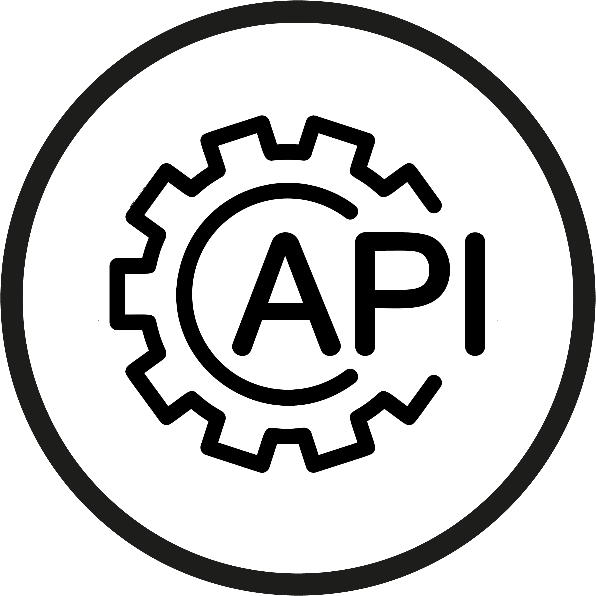

<h1 align="center">Welcome to my profile!</h1>

I'm Ronak Luhar, Fullstack developer from India.

- 🔭 I’m currently working at **Infynno Solutions in Ahmedabad**
- 👯 I’m looking to collaborate on **SaaS Development**
- 💬 Ask me about **Web and Mobile Development**
- 📫 How to reach me: [ronakmethan@gmail.com](mailto:ronakmethan@gmail.com) via email

---
<h2 align="left" id="ronakluhar-tech">Favorite Tech & Stats</h2>

> Tools, languages, and other things that I like to work with.

<table>
  <tr>
    <td align="center" width="130">
      
       Laravel
    </td>
    <td align="center" width="130">
      
       Node.js
    </td>
    <td align="center" width="130">
      
       Reactjs
    </td>
    <td align="center" width="130">
      
       TypeScript
    </td>
    <td align="center" width="130">
      
       MySql
    </td>
    <td align="center" width="130">
      
       Postgresql
    </td>
    
   
  </tr>
  <tr>
    <td align="center" width="96">
      
       AWS
    </td>
    <td align="center" width="96">
      
       Graphql
    </td>
    <td align="center" width="96">
      
       SaaS
    </td>
    <td align="center" width="96">
      
       API
    </td>
   <td align="center" width="96">
      
       Docker
    </td>
    <td align="center" width="96">
      
       GitHub
    </td>
  </tr>
</table>

  
  
  
   
  

